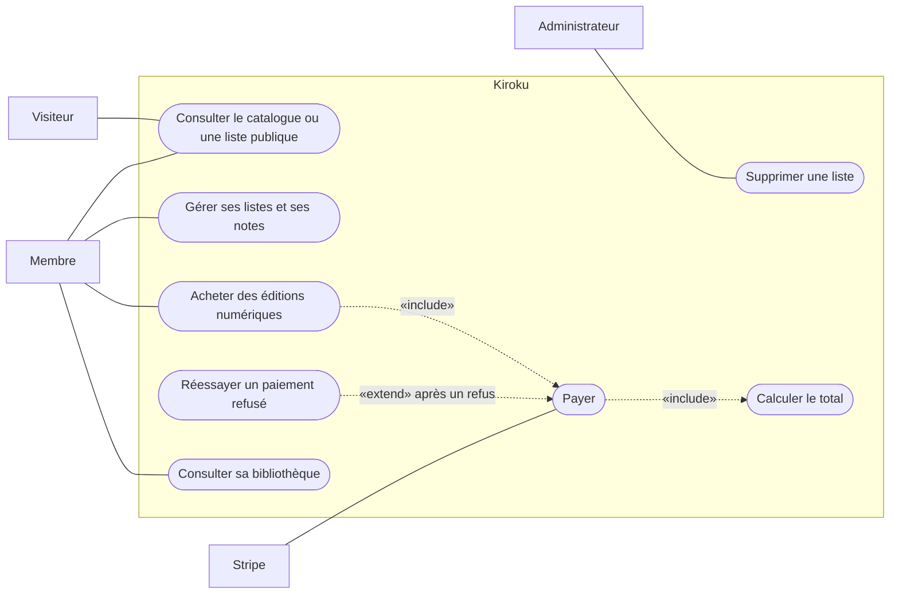

# Diagramme de cas d’utilisation — Kiroku

```mermaid
flowchart LR
    V[Visiteur]
    M[Membre]
    A[Administrateur]
    S[Stripe]
    subgraph Kiroku
        C([Consulter le catalogue ou une liste publique])
        L([Gérer ses listes et ses notes])
        B([Acheter des éditions numériques])
        P([Payer])
        R([Réessayer un paiement refusé])
        E([Consulter sa bibliothèque])
        D([Supprimer une liste])
        T([Calculer le total])
    end
    V --- C
    M --- C & L & B & E
    A --- D
    B -. "«include»" .-> P
    P -. "«include»" .-> T
    R -. "«extend» après un refus" .-> P
    S --- P
```
