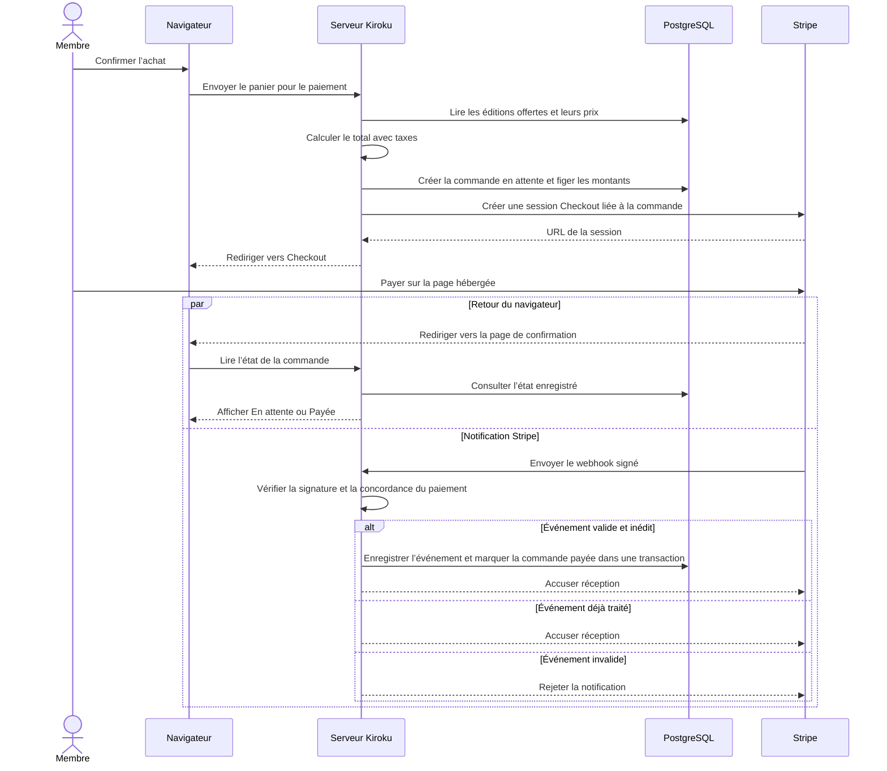

# Séquence du paiement — Kiroku

```mermaid
sequenceDiagram
    actor M as Membre
    participant N as Navigateur
    participant K as Serveur Kiroku
    participant B as PostgreSQL
    participant S as Stripe
    M->>N: Confirmer l’achat
    N->>K: Envoyer le panier pour le paiement
    K->>B: Lire les éditions offertes et leurs prix
    K->>K: Calculer le total avec taxes
    K->>B: Créer la commande en attente et figer les montants
    K->>S: Créer une session Checkout liée à la commande
    S-->>K: URL de la session
    K-->>N: Rediriger vers Checkout
    M->>S: Payer sur la page hébergée
    par Retour du navigateur
        S-->>N: Rediriger vers la page de confirmation
        N->>K: Lire l’état de la commande
        K->>B: Consulter l’état enregistré
        K-->>N: Afficher En attente ou Payée
    and Notification Stripe
        S->>K: Envoyer le webhook signé
        K->>K: Vérifier la signature et la concordance du paiement
        alt Événement valide et inédit
            K->>B: Enregistrer l’événement et marquer la commande payée dans une transaction
            K-->>S: Accuser réception
        else Événement déjà traité
            K-->>S: Accuser réception
        else Événement invalide
            K-->>S: Rejeter la notification
        end
    end
```
